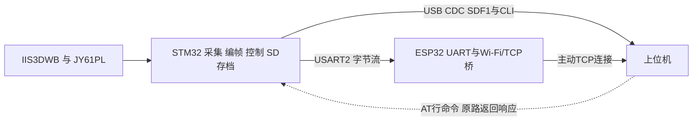
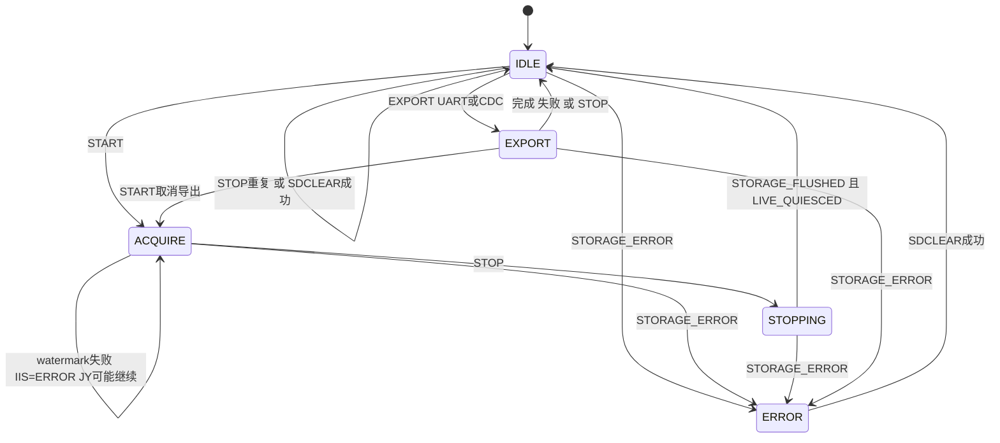

# 上位机固件接口交接手册

本文面向接手开发新上位机的工程师，给出当前固件可直接用于连接、解码、控制、记录和诊断的最小接口合同。结论来自下列三个仓库当前检出版本的静态代码、直接测试和黄金帧；未连接或控制硬件。STM32 固件是 SDF1、AT 命令、实时流和 SD 存档行为的权威来源，ESP32 固件是 UART 与 Wi-Fi/TCP 桥接行为的权威来源，现有 SensorHost 仅作为接收端参考实现。

## 1 文档基线与适用范围

| 仓库 | 职责 | 分支 | HEAD |
|---|---|---|---|
| `D:\Codes\STM32\STM32407ZG_JY61PL_II3DWB_UART_V2` | 设备状态、SDF1、AT 命令、实时流、SD 存档与导出 | `master` | `440661913e223f023bc71d65b125668db6518ac2` |
| `D:\Codes\ESP32\ESP32_WIFI_UART_BRIDGE` | UART 与 Wi-Fi/TCP 桥接、TCP 重连、UDP 唤醒 | `feature/bridge-iterations` | `388a0b4343e711e14b9df352c709c48907472c35` |
| `D:\Codes\SensorHost` | 解析、连接、控制和记录的参考实现 | `ui-review-plan` | `aeacedf5d3e508e3240e1eabf4c05bb40d86d9b5` |

STM32 和 SensorHost 工作区在取证开始时无改动。ESP32 工作区已有用户修改 `.vscode/settings.json`，本文未触碰。ESP32 的 `sdkconfig` 和 `build` 被 Git 忽略，因此 HEAD 只能追溯源码和默认配置，不能证明设备中实际烧录的配置。

静态分析无法确认或必须依赖硬件的事项如下，后文不再重复：

- **待确认**：ESP-IDF 未显式调用 `esp_wifi_set_storage` 时，运行时 Wi-Fi 配置的底层持久化细节；上位机应视编译期配置为每次冷启动的覆盖值。
- **待实机确认**：ESP32 当前本机 `sdkconfig` 与 `build\config\sdkconfig.h` 是否对应实际已烧录镜像。
- **待实机确认**：实际 Wi-Fi 凭据、接入点可达性、动态主机配置（DHCP）地址、上位机监听地址和防火墙。
- **待实机确认**：STM32 与 ESP32 是否共地、电平兼容、收发交叉，以及若板间经过 MAX3490/RS-485 时的方向、极性和终端电阻。
- **待实机确认**：端到端吞吐、CDC 忙频率、UART 溢出门槛、断线恢复时间、SD 掉电恢复和硬件时序。

## 2 系统链路与职责边界



- STM32 负责传感器采集、全局传感器 sequence、UUID、SDF1 编码、AT 状态机、实时调度以及 SD 权威存档。
- ESP32 不解释 SDF1，也不提供设备身份；它从 STM32 UART 收字节并作为 TCP 客户端上传，同时把 TCP 下行字节写回 STM32 UART。
- ESP32 并非完全透明：以 `HRT` 开头的 TCP 接收块会被本地消费并回 `ALE`；遗留二进制协议识别也以单次 `recv()` 为单位。新上位机只应发送本文规定的 ASCII AT 行，不应依赖这些遗留分支。
- TCP 是连续字节流。一次 `recv()` 可能得到半帧、多帧或任意切片；必须为每个连接维护独立流缓冲，绝不能把一次 `recv()` 当作一帧。
- STM32 的 UART/CDC 发送完成、ESP32 的 TCP 队列接受以及主机 recorder 入队，都不等于对端或磁盘已持久化；当前链路没有端到端 ACK、credit 或窗口流控。

## 3 接线 默认配置与上电状态

### 3.1 STM32

| 接口 | 当前配置 | 接入要点 |
|---|---|---|
| USB CDC | USB 虚拟串口；主机常以 115200 打开，但该值不改变 USB 实际速率 | 同一端点承载 SDF1 数据和 AT 命令/响应 |
| USART2 | PA2=TX，PA3=RX；115200，8N1，无 RTS/CTS | 可在 IDLE 用 `AT+BAUD=9600..3000000` 修改并持久化；主机和 ESP32 必须同步 |
| 控制行 | 可打印 ASCII，最大 96 字符；以 LF 完成，推荐统一发 `\r\n` | 裸 `\r` 不会立即执行 |

STM32 上电状态为 `IDLE`，IIS 停止、JY 发布关闭；实时目标恢复为 `UART`，watermark 恢复为 `511`。UART baud 和配置 UUID 持久化；实时目标、watermark 和运行状态不持久化。sequence 从 SD superblock 的 `next_data_sequence` 恢复，无有效存档或成功 `SDCLEAR` 后从 0 开始。未配置 UUID 时，由 MCU UID 和固定命名空间派生。

### 3.2 ESP32

| 项目 | 已提交默认/范围 | 当前本机生成配置 | 说明 |
|---|---|---|---|
| 模式 | Wi-Fi STA | STA | 由网络 DHCP 获取本机地址；未实现 AP、静态 IP 或 DNS 主机名解析 |
| TCP | ESP32 主动连接 IPv4 服务端；端口 54321 | `10.145.81.210:54321` | 本机值未纳入 Git，实际设备配置待实机确认 |
| UDP | 监听端口 12345，可配置为 0 禁用 | 12345 | 只在 TCP 重试耗尽或显式停止后监听 |
| UART | UART1，TX=GPIO44，RX=GPIO43，115200 8N1，无流控 | 相同 | 这里只确定逻辑方向；实际板间可能经过 MAX3490/RS-485，不能据此直接跳线 |
| 重试 | Wi-Fi 最多 5 次；TCP 最多 5 次、间隔 1000 ms；0 表示无限 | 相同 | TCP 在线断开后仍会回到主动连接循环 |

`main\Kconfig.projbuild`、`sdkconfig.defaults` 与本机忽略的 `sdkconfig` 对 Wi-Fi/服务器值并不一致。新克隆时 `sdkconfig.defaults` 将 SSID 和密码置空，若不先配置，`wifi_module_init` 会失败并停止 UART 桥任务。仓库中存在明文现场默认凭据，不应复制到交接资料或新工程；应在构建/部署环节重新配置并按秘密管理。每次冷启动都会把编译期 SSID/密码写入 STA 配置。

## 4 两种上位机接入流程

### 4.1 USB CDC 直连 STM32

1. 打开 CDC 端点，为该连接创建独立 SDF1 parser、命令事务和记录上下文。
2. 发送 `AT\r\n`，等待同一链路上的 SDF1 `CLI_RESPONSE` 包含 `OK`。
3. 发送 `AT+UUID?`，保存 `+UUID:36字符UUID,SOURCE=CONFIGURED|DERIVED`；再发 `AT+STATE?`，解析状态并等待 `+SD` 中 `READY=1`。若 `FORMAT_REQUIRED=1`，必须由用户决定是否执行破坏性的 `AT+SDCLEAR=CONFIRM`。
4. 查询 `AT+LIVESTREAM?`。若目标不是 CDC，先保证设备为 `IDLE`，再发 `AT+LIVESTREAM=CDC` 并等待 `OK`。若设备正在 `ACQUIRE`，先执行停止流程，不能直接切换不同目标。
5. 发送 `AT+START` 并等待 `OK`；之后接收 V2 IIS/JY 传感器帧，同时允许 V1 STATUS/CLI 响应交错出现。
6. 停止时只发送一次 `AT+STOP`。`OK` 表示 SD flush 与实时 quiesce 均已完成；响应前允许唯一在途实时帧自然发完，响应后不应再有主动实时传感器帧。STOP 不上传历史。

### 4.2 经 ESP32 的 Wi-Fi/TCP 接入

1. 上位机先在 ESP32 编译配置指定的 IPv4/端口监听 TCP；当前配置参考为 54321。ESP32 获得 IP 后主动连接，上位机不是 TCP 客户端。
2. 若 ESP32 已耗尽 TCP 重试并进入 UDP 等待，可向端口 12345 发送恰好 10 字节、大小写敏感、无 NUL 的 `TCPCONNECT`。它只触发重新主动连接，不返回 UDP 应答，也不提供设备发现信息。
3. `accept()` 后为该 socket 创建独立 parser。通过 TCP 发送的 AT ASCII 行由 ESP32 写入 STM32 USART2；CLI_RESPONSE、STATUS 和传感器帧沿同一 TCP 字节流返回。
4. 重复直连流程中的 `AT`、`AT+UUID?`、`AT+STATE?`。实时目标必须是 `UART`；若不是，先进入 `IDLE` 再执行 `AT+LIVESTREAM=UART`。
5. TCP EOF 或 socket 错误后关闭该物理会话但保持 listener；ESP32 会再次主动连接。把新 socket 当成新传输会话，重置 parser/sequence 基线并重新查询 UUID。相同 UUID 可接续逻辑设备，但应创建新的记录分段。
6. ESP32 的单个全局 socket 只支持一个上位机服务端。多 ESP32 对应多个 TCP 连接；一条物理连接预期只出现一个 STM32 UUID。同一连接 UUID 改变或两个在线连接报告相同 UUID时应隔离并报警。

当前 SensorHost listener 的 16 连接上限只是参考实现容量，不是固件协议上限。TCP 半开连接没有 keepalive 或应用层心跳保证；长期只有 read timeout 但无 EOF 时，应结合心跳/状态查询判定健康度。

## 5 SDF1 数据协议

### 5.1 V1 与 V2 帧

所有多字节字段均为小端。CRC 字段也以小端 u32 放在线尾。

| 偏移 | 长度 | 字段 | 定义 |
|---:|---:|---|---|
| 0 | 4 | magic | ASCII `SDF1` |
| 4 | 1 | version | `1`=控制帧，`2`=当前传感器帧 |
| 5 | 1 | message_type | `1` IIS3DWB，`2` JY61PL，`3` STATUS，`4` CLI_RESPONSE |
| 6 | 2 | flags | 消息专用标志 |
| 8 | 2 | header_size | V1=`28`，V2=`44` |
| 10 | 2 | payload_size | `0..3577` |
| 12 | 4 | sequence | IIS/JY 全局 u32 序号；当前 STATUS/CLI 固定为 0 |
| 16 | 8 | timestamp_us | MCU 单调微秒时间 |
| 24 | 2 | item_count | payload 中逻辑项目数 |
| 26 | 2 | reserved | 固定 0 |
| 28 | 16 | device_uuid | 仅 V2；canonical UUID 去连字符后的 16 字节原序，不做 GUID 端序翻转 |
| `header_size` | N | payload | V1 从 28、V2 从 44 开始 |
| `header_size+N` | 4 | crc32 | 覆盖完整 header 与 payload |

协议最大 payload 为 3577 字节；V1/V2 最大帧分别为 3609/3625 字节。实际 CLI payload 受控制缓冲限制为 768 字节。CRC 为 CRC-32/ISO-HDLC：反射多项式 `0xEDB88320`、初值 `0xFFFFFFFF`、最终异或 `0xFFFFFFFF`，与 `zlib.crc32(data) & 0xffffffff` 一致。

传感器序号只在 STM32 Router 统一分配，IIS/JY 共用一个 u32 空间并自然回绕。上位机只用通过语义校验的 IIS/JY 帧推进缺口基线；STATUS/CLI 不参与。UUID 修改不重置 sequence，`SDCLEAR` 会将 sequence epoch 重置为 0。

### 5.2 IIS3DWB FIFO

type=1，payload 必须为 `item_count × 7` 字节，最多 511 个 FIFO word：第 0 字节为原始 tag，第 1..6 字节为数据。`sensor_tag=tag>>3`，`tag_counter=(tag>>1)&3`，`tag_parity=tag&1`。

| sensor_tag | 数据解释 | 上位机处理 |
|---:|---|---|
| 2 | 3 个连续小端 i16：x、y、z | 当前 ±2 g，`g = raw × 0.000061` |
| 3 | 前 2 字节为温度 raw i16 | 仓库未定义摄氏换算，保留 raw |
| 4 | 前 4 字节为 u32 sensor tick | 1 tick=25 µs，扩展 32 位回绕 |
| 其他 | 未定义原始 word | 保留原始数据并跳过，不得当作加速度 |

flags bit0 表示读取前见到 FIFO overrun，bit1 表示启用 timestamp batching，bit2 表示自上次可报告批次以来发生 IIS 源侧丢弃。当前 ODR/BDR 为 26.7 kHz，默认每 32 个 batching event 插入时间戳 word。用同一帧的 MCU `timestamp_us` 锚定 sensor tick 到 MCU 单调时间；后续无 timestamp tag 的帧沿用最近 offset，新 tag 重新校准。相邻加速度约 37.5 µs 只是当前参考实现的近似重建，不是 UTC 或逐样点硬件时间保证。

### 5.3 JY61PL

type=2，payload 固定 14 字节，`item_count=1`：

```text
小端 i16 acc_x, acc_y, acc_z, temperature,
小端 i16 roll, pitch, yaw
```

换算为：加速度 `raw × 16 / 32768 g`，温度 `raw / 100 °C`，角度 `raw × 180 / 32768°`。固件只在收到一组校验有效的 acceleration packet 与 angle packet 后发布；时间戳是在组合样本提交 Router 前取得的 MCU 时间，不是传感器内部时间。

### 5.4 STATUS 与 CLI_RESPONSE

STATUS 为 V1、type=3、payload 64 字节、`item_count=1`、sequence=0：

| payload偏移 | 类型 | 字段与当前语义 |
|---:|---|---|
| 0 | u8 | `status_version=1` |
| 1 | u8 | `active_transport`，当前固定 2 的 legacy 值，不能据此判断实时目标 |
| 2 | u8 | `pending_transport`，当前固定 0 |
| 3 | u8 | IIS 状态：0 stopped，1 running，2 error |
| 4 | u16 | watermark |
| 6 | u16 | `free_data_buffers`，当前未提供而固定 0 |
| 8 | u32 | legacy/reserved，固定 0 |
| 12 | u32 | `data_queue_peak`，当前未提供而固定 0 |
| 16 | u32 | `fifo_overruns` |
| 20 | u32 | IIS+JY `source_drops` 饱和和 |
| 24 | u32 | `transport_drops`=`uart_start_failures+cdc_start_failures`；不含 live-drop 与 UART DMA error |
| 28 | u32 | IIS SPI DMA errors |
| 32 | u32 | UART2 TX DMA、JY UART DMA、Control UART RX errors 之和 |
| 36 | u32 | CDC start failures |
| 40 | u32 | command errors 与 IIS config errors；并非所有 `ERROR:*` 的精确计数 |
| 44..52 | 5×u16 | 任务栈余量字段，当前未提供而固定 0 |
| 54 | u16 | reserved=0 |
| 56 | u64 | `uptime_us` |

CLI_RESPONSE 为 V1、type=4、sequence=0；payload 是非空 UTF-8/ASCII 文本，通常以 `\r\n` 结束。响应必须回到命令来源链路。`AT+STATE?` 依次返回 `+STATE`、`+BAUD`、`+UUID`、`+SD`、`+EXPORT`、`+LIVE`、`+DIAG`、`+STOP_REASON` 和 `OK`。实时目标以 `+LIVE:TARGET` 或 `AT+LIVESTREAM?` 为准，不使用 STATUS 的 legacy transport 字段。

### 5.5 流解析器合同

1. 搜索 `SDF1`；找不到时只保留可能构成下一 magic 的最后 3 字节。
2. 等到 28 字节公共头后验证 payload 上限；当前 V1 必须 `header_size=28`，V2 必须 `header_size=44`，通用防御上限可设 256。
3. 等待 `header_size + payload_size + 4` 字节完整候选，先验 CRC，再解释 version/type/payload。
4. header/length/CRC 错误时只从候选首字节后重新搜索，不能按不可信长度盲跳。
5. CRC 正确但 version/type 未知时，按已验证长度整体跳过，避免 payload 内的 `SDF1` 误触发。
6. 对 IIS/JY 再验证 payload 语义；分别统计字节丢弃、header、length、CRC、未知类型、payload 错误。
7. sequence 使用 u32 模运算处理 `0xffffffff→0`；把缺口、重复、后退/设备重启分开记录。每个新物理连接或 UUID 会话显式重置基线。
8. `ARCHIVE_EXPORT=flags & 0x8000`。导出帧与实时帧分别送入独立 sink；协议错误、链路断开、实时 live-drop、源侧 `source_drops` 和存档导出缺失是不同故障域。

当前黄金文件 `tests\golden\stream_v1_frames.bin` 共 267 字节，实际清单为 V2 IIS 62 字节、V2 JY 62 字节、V1 STATUS 96 字节、V1 CLI 47 字节，offset 为 0/62/124/220。现有 `docs\PROTOCOL.md` 的旧 46/46/96/47 清单已漂移，不得作为新测试期望。

## 6 AT 命令 状态与重试策略

AT 输入是以 LF 完成的行文本，不是 SDF1；推荐始终发送 `\r\n`。响应封装为同链路上的 SDF1 CLI_RESPONSE。命令大小写敏感。

| 命令 | 参数与允许状态 | 成功响应/副作用 | 主要错误 | 安全重试 |
|---|---|---|---|---|
| `AT` | 全状态 | `OK` | 超时/TX 资源 | 是，有限退避 |
| `AT+STATE?` | 全状态，含 SD 待格式化 | 多行状态+`OK` | `ERROR:RESPONSE_TOO_LARGE`、尽力 `ERROR:TX_BUSY` 或仅超时 | 是，有限退避 |
| `AT+BAUD?` | 全状态 | `+BAUD:n`+`OK` | 超时 | 是 |
| `AT+BAUD=n` | 仅 IDLE；9600..3000000 且硬件误差≤2% | 旧 baud 回应后切换；持久化 | `ARGUMENT/RANGE/STATE/FLASH/BUSY/BAUD_APPLY` | 否；超时先查询 |
| `AT+UUID?` | 全状态 | UUID、来源+`OK` | 超时 | 是 |
| `AT+UUID={canonical-uuid}` | 仅 IDLE；36 字符 UUID | 持久化；sequence 不重置 | `ARGUMENT/STATE/FLASH` | 否；超时先查询 |
| `AT+LIVESTREAM?` | 全状态 | 当前 UART/CDC+`OK` | 超时 | 是 |
| `AT+LIVESTREAM=UART|CDC` | 不同目标仅 IDLE；同目标全状态接受 | 切换互斥实时目标；不持久化 | `ARGUMENT/STATE/BUSY` | 同目标安全；BUSY 可有限退避 |
| `AT+START` | IDLE→ACQUIRE；ACQUIRE 重复为 OK；EXPORT 时取消导出后启动 | 启动发布，`OK` | `SD_FORMAT/STATE` | 响应不确定时先查状态，不盲发 |
| `AT+STOP` | ACQUIRE→STOPPING；IDLE 重复为 OK；EXPORT 时取消 | 双完成后 `OK`；不上传历史 | `STATE/STORAGE` | 响应不确定时先查状态，不盲发 |
| `AT+EXPORT[=UART|CDC]` | 仅 IDLE；省略目标等于 UART | `EXPORT_BEGIN`、`OK`，随后 `EMPTY/END/ABORTED` | `STATE` | 否；可能已回收完整 chunk |
| `AT+SDCLEAR=CONFIRM` | 仅 IDLE 或 ERROR | 完成后 `OK`；清空 SD 并把 sequence 重置 0 | `STATE` | 否；须用户确认，超时先查状态 |
| `acq watermark 128|256|511` | stopped/running 均可重配 | `OK`；不持久化 | `ARGUMENT/RANGE/STATE` | 查询状态后再决定 |
| `status` | 全状态兼容命令 | STATUS 帧后 CLI `OK` | 排队失败可能只表现为超时 | 是 |
| `acq start` / `acq stop` | START/STOP 兼容别名 | 同上 | 同上 | 同上 |
| `help` | 全状态 | 命令列表+`OK` | 带参数=`ARGUMENT` | 是 |
| `transport cdc|uart` | 已弃用 | 无 | `ERROR:UNSUPPORTED` | 不重试 |

parser 还可能返回 `ERROR:COMMAND`（空行、非 ASCII、过长或未知）、`ERROR:ARGUMENT` 和 `ERROR:RANGE`。命令队列深度为 8；控制 buffer 为 800 字节、共 8 个。资源耗尽时 `ERROR:TX_BUSY` 本身也可能无法发送，因此“响应超时 + `command_errors` 增量”比等待固定错误文本更可靠。

新上位机应让每连接最多一个命令事务处于 outstanding，使用期望文本/状态谓词关联响应，并允许传感器帧、STATUS 和异步导出事件同时通过。幂等查询遇 BUSY/TX_BUSY/timeout 可采用例如 0.5/1/2 s 的有限退避；这只是当前验收工具的参考策略，不是协议硬门限。对具有副作用的命令，响应不确定时先 `AT+STATE?` 核验，不能自动重发。

设备控制状态是 `IDLE`、`ACQUIRE`、`STOPPING`、`EXPORT`、`ERROR`；设备级 `ERROR` 由存储错误进入。IIS 另有独立的 `ACQUISITION_STATE_ERROR=2` 配置失败安全态，失败时 IIS 停止 ODR并切 FIFO bypass，但设备状态与 JY 行为取决于命令路径：

- IDLE 下 START 配置失败：控制层关闭 JY并把设备状态回滚为 `IDLE`，IIS 保持 error；此时 STOP 只是 IDLE 的重复命令，不会调用 IIS stop。后续 START 会以 IIS error 为条件执行完整重配置。
- `ACQUIRE` 中执行 `acq watermark` 重配置失败：设备状态仍为 `ACQUIRE`，控制层不会关闭 JY，因此 JY 仍可能发布而 IIS 已停止。应先 STOP，使 IIS error 路径尝试恢复 stopped 并完成正常停止，再在 IDLE 下 START。

因此不能只看 `+STATE`；还必须检查 STATUS payload offset 3 与 offset 40 的配置错误增量。



## 7 实时流 SD 存档与导出

实时副本与 SD 权威存档是两条不同语义的路径：Router 对同一已编码帧先提交实时 sink，再提交存储 sink；实时拥塞不应被解释为 SD 丢失，只有 `source_drops`、存储错误或导出验证失败才影响存档可信度。

- UART 与 CDC 实时目标互斥；非目标链路不接收主动传感器帧，但仍可发送 AT 并接收原路控制响应。选择 CDC 但未连接时不会自动回退 UART。
- IIS 实时队列是 active+pending 双槽，pending 被新帧替换，表现为丢旧保新。JY 是深度 4 FIFO，满时丢新；对外统一合同是“实时允许丢帧并保持存档独立”，不能声称两类都严格 newest-wins。
- UART 115200 远低于峰值数据量时，正的 `DROPS_IIS/JY`、送达 sequence 缺口和较大 routed/completed lag 可以是允许的实时带宽结果。不要据此推断 SD 丢失，也不要把验收工具的 lag 或时长门限写成协议要求。
- CDC live 遇 BUSY 最多由固件内部重试 8 次；最终失败计 live-drop 和 CDC 相关诊断。切换目标会清空待发实时队列并计 drop，防止跨 backend 泄漏。
- STOP 丢弃并计数所有未开始实时帧，让唯一在途帧完成；SD flush 和 live quiesce 都完成后才回 OK。OK 后 live latch 禁止新主动帧，直到下一次成功 START。EXPORT 帧不受该 live latch 限制。
- SD 以 512 字节 block、8 blocks/4096 字节 chunk 保存；block 0/1 为交替 superblock，2..7 保留，8 起为环形 chunk。帧不跨 chunk。满盘时覆盖最旧 chunk并累计 `OVERWRITTEN_CHUNKS/FRAMES`，采集保持 ACQUIRE。
- EXPORT 仅在 IDLE 启动，从最旧 retained chunk 开始。发送副本设置 bit15 `ARCHIVE_EXPORT` 并重算 CRC，不修改 SD 原帧。整 chunk 最后一帧成功发送后才回收该 chunk。
- 导出失败或取消会保留当前 chunk；下次从该 chunk 第一帧重新开始，因此允许最多重复一个 chunk但不应漏帧。主机应按完整帧和业务键去重，不能仅假设连续 TCP 字节无重复。
- ESP32 TCP send 在部分发送后失败时会把整个队列项重新放回队头，重连后可能重复已发送前缀；其队列回插失败还可能静默丢包。SDF1 parser 必须能重同步，应用必须用 sequence/CRC/导出上下文检测重复与缺失。

## 8 诊断 错误与恢复

`AT+STATE?` 中应记录：`+STATE`、`+BAUD`、`+UUID`、`+SD` 的 READY/FORMAT_REQUIRED/retained/overwritten、`+EXPORT`、`+LIVE` 的目标与两类 drops、last routed/completed、`+DIAG` 的 pool/ingress/no-store、SD stall、CDC live/control/export，以及 `+STOP_REASON`。STATUS 中应记录 offsets 16/20/24/28/32/36/40/56；当前固定 0 的资源/栈字段只能显示为“未提供”。

| 现象 | 重点字段/证据 | 可能原因 | 建议动作 |
|---|---|---|---|
| 建连后无数据 | `+STATE`、`+LIVE:TARGET`、SD READY | 未 START、选错实时目标、CDC 未连、配置失败 | 查询状态；IDLE 下选对目标；只发一次 START并等响应 |
| CRC/header/length 错误 | parser 分项计数、UART overflow | 噪声、波特率不一致、ESP 重连边界、缓冲溢出 | 逐字节重同步；核对 baud/接线；保留原始诊断片段 |
| sequence 缺口 | `DROPS_IIS/JY`、`source_drops`、overwritten、export上下文 | 允许的实时丢帧、源侧丢弃、重启/清卡、链路丢失 | 先分类再告警；live-drop 不等于 SD 丢失；重启/UUID会话重置基线 |
| CDC 选中但无输出 | `TARGET=CDC`、offset36、`CDC_LIVE` | CDC 未打开或端点 BUSY；不会回退 UART | 打开 CDC；必要时 STOP 后切回 UART |
| TCP 断线 | socket EOF/error、ESP TCP 状态 | 服务端退出、Wi-Fi 断线、重试耗尽 | listener 持续监听；必要时 UDP 发精确 `TCPCONNECT`；新连接重查 UUID |
| 实时拥塞 | live drops、routed-completed、offset32/36 | UART 带宽不足、CDC BUSY | 保持存档路径；降低展示预期，不把实时缺口当存档损坏 |
| 源侧丢弃 | STATUS offset20；`POOL_FAIL/INGRESS_DROP/NOSTORE_DROP` | frame pool、storage ingress 或 storage sink 失败 | 视为存档完整性风险；停止并保存诊断，检查 SD/负载 |
| SD 未就绪/需格式化 | `READY=0`、`FORMAT_REQUIRED=1`、`ERROR:SD_FORMAT` | 恢复扫描未完或介质格式无效 | 等 READY；格式化必须用户确认后仅发一次 SDCLEAR |
| 命令超时 | CLI marker、offset40、`CDC_CTRL` | 响应与数据争用、控制 buffer 耗尽、链路断开 | 幂等查询有限退避；副作用命令改用 STATE 核验，不盲重发 |
| IIS 配置失败安全态 | `+STATE` 可能为 IDLE 或 ACQUIRE；STATUS offset3=2；offset40 增量 | START 配置失败，或运行中 watermark 重配置失败 | IDLE 路径由后续 START 完整重配置；ACQUIRE 路径先 STOP 再 START；反复失败检查传感器 |
| 设备级 ERROR | `+STATE:ERROR`、STOP_REASON、SD/存储字段 | 存储错误 | 保存日志；确认介质处置后再决定 SDCLEAR |

ESP32 还提供内部 UART 统计：无 block、队列满、FIFO overflow、RX buffer full、上行重试/丢弃、TX failure/busy。当前桥接应用没有把这些计数通过网络协议导出；若只能从上位机观察，应以 CRC、sequence、断线和 STM32 source/live 诊断间接定位。Wi-Fi/TCP 模块也没有字节数、队列丢弃或 socket 错误计数，这是当前诊断限制。

## 9 新上位机最小实现清单

第一版至少应具备：

- CDC 串口与 TCP server 两种接入；区分 timeout、EOF 和异常。
- 每物理连接独立的流缓冲、SDF1 parser、统计、UUID、sequence 基线、命令事务和文件 sink。
- V1 control/V2 sensor、CRC、小端、UUID、IIS tag/JY 固定点换算、timestamp 回绕与近似时间重建。
- 任意分块、粘包、半帧、噪声、坏 header/CRC、payload 内 magic 和未知帧的安全重同步。
- 传感器 sequence 的 wrap/gap/duplicate/backward-reset 分类；新连接和新 UUID 显式开新 epoch。
- 命令与异步数据并行接收；每连接串行 outstanding、响应谓词、超时、幂等分类和状态核验。
- STATUS/STATE 结构化诊断；实时与 ARCHIVE_EXPORT 分流；未挂 export sink 时明确计数/报警。
- 按 UUID 和重连分段保存通过验证的完整原始 SDF1 帧；有界异步写队列、溢出错误、flush/fsync 和元数据。
- TCP listener 持续运行、ESP 重连重新识别、同连接 UUID 改变和在线 UUID 冲突隔离、日志留痕。

静态联调检查清单：

- [ ] 用 `tests\golden\stream_v1_frames.bin/json` 对逐字节、随机分块和整流输入得到完全相同帧。
- [ ] 注入垃圾、坏 CRC、坏 header、超长 payload、payload 内 magic，确认下一帧可恢复。
- [ ] 覆盖 `0xfffffffe,0xffffffff,0,1`、普通 gap、重复、后退/重启和 SDCLEAR epoch。
- [ ] 用本地 socket 对覆盖半帧、多帧粘包、timeout、EOF和多连接 parser 隔离。
- [ ] 交错 sensor、STATUS、CLI 和 archive 帧，确认响应关联与实时/导出 sink 不串流。
- [ ] 覆盖 BUSY/TX_BUSY/timeout：幂等查询有限退避，START/STOP/EXPORT/SDCLEAR 不自动重发。
- [ ] 覆盖同连接 UUID 改变、两个在线连接同 UUID、旧连接断开后相同 UUID 新连。
- [ ] 注入 recorder 队列超限、磁盘写失败、断连中止，确认错误和文件边界可追溯。
- [ ] 检查 Markdown/协议常量来源后，再安排实机 CDC、TCP、吞吐、断线恢复和 SD 掉电验收。

真正的端到端吞吐、断线恢复时间、UART/CDC 硬件时序、现场 UDP 可达性和 SD 掉电行为仍需后续实机验收。

## 10 已知限制与事实来源

影响新上位机设计的限制：

- ESP32 是单 socket TCP 客户端，不是服务端；UDP 只是无响应唤醒，不是带身份的发现协议。
- ESP32 下行按单次 TCP `recv()` 做遗留协议识别，存在 `HRT` 本地消费边界；不要把它宣传为无条件帧透明。
- ESP32 队列、socket 与 UDP 错误统计未对上位机开放；部分队列回插失败可能静默丢数据。
- STM32 没有端到端 ACK/credit/RTS-CTS。低带宽 UART 的实时缺口可以是设计允许的 live-drop，SD 才是权威存档。
- STATUS 的 active/pending transport、free buffers、queue peak 和 stack watermarks 当前不可作为真实运行指标。
- 当前 SensorHost 主应用能并行收命令响应和数据，但没有完整命令-响应关联、deadline 与安全重试；这些必须在新实现中补齐。
- 当前 SensorHost 对 sequence 后退、重复和设备重启缺少独立统计；解析器接受 V1 sensor 只是宽松兼容，不代表当前固件会发送。
- 当前 SensorHost 只保存成功解析的有效完整帧，不保存噪声、坏 CRC 或未知帧；若需要链路法证，应另设 transport raw capture。

关键事实来源索引：

| 主题 | STM32 权威来源 | ESP32/上位机交叉来源 |
|---|---|---|
| SDF1 布局/CRC | `app\Protocol\stream_protocol.h`；`app\Protocol\stream_protocol.c`；`test\host\test_stream_protocol.c` | `src\sensor_host\protocol\sdf1.py`；`tests\test_protocol.py`；`tests\golden\stream_v1_frames.json` |
| UUID/sequence | `app\Pipeline\frame_router.c`；`app\Identity\device_uuid.c`；`app\Storage\storage_pipeline.c` | `src\sensor_host\acquisition\controller.py`；`tests\test_node_sessions.py` |
| IIS/JY payload | `app\App_iis3dwb\App_iis3dwb.c`；`app\App_Jy61pl\App_Jy61pl.c`；`test\host\test_jy61pl.c` | `src\sensor_host\protocol\sdf1.py`；`tests\test_protocol.py` |
| STATUS/CLI | `app\Transport\status_snapshot.c`；`app\Transport\transport.c`；`app\Control\control_response_core.c` | `src\sensor_host\protocol\control_state.py` |
| 命令/状态机 | `app\Control\control_parser.c`；`app\Control\control.c`；`app\Control\device_state_core.c`；`test\host\test_device_state_core.c` | `tools\realtime_archive_acceptance.py`；`tests\test_realtime_archive_acceptance.py` |
| 实时与 STOP | `app\Transport\transport.c`；`app\Transport\live_queue_core.c`；`test\host\test_live_queue_core.c` | `tests\test_acquisition_controller.py` |
| SD/EXPORT | `app\Storage\sd_spool.c`；`app\Storage\sd_chunk_core.c`；`app\Storage\storage_pipeline.c`；对应 `test\host\test_sd_*` | `src\sensor_host\storage\recorder.py`；`tests\test_recorder_replay.py` |
| STM32 UART/CDC | `Core\Src\usart.c`；`STM32407ZG_JY61PL_II3DWB_UART.ioc`；`USB_DEVICE\App\usbd_cdc_if.c` | `src\sensor_host\transport\cdc_serial.py`；`tests\test_transport.py` |
| ESP UART/TCP/UDP | — | `main\main.c`；`main\Kconfig.projbuild`；`sdkconfig.defaults`；`components\uart_pt\uart_pt.c`；`components\wifi_module\wifi_module.c` |
| TCP listener/会话 | — | `src\sensor_host\transport\gateway.py`；`src\sensor_host\acquisition\sessions.py`；`tests\test_gateway_transport.py` |
